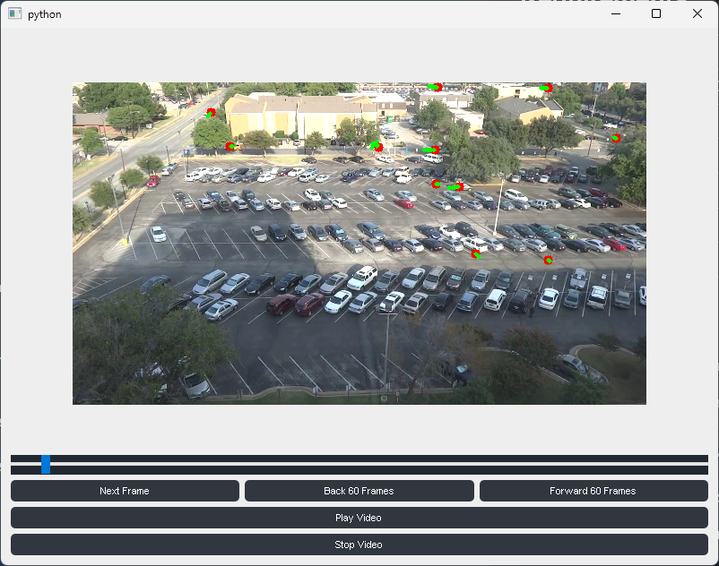

# Detecting Motion



- [Detecting Motion](#detecting-motion)
  - [Description](#description)
  - [Requirements](#requirements)
  - [Installation](#installation)
    - [Option 1: Using the Provided Virtual Environment](#option-1-using-the-provided-virtual-environment)
    - [Option 2: Using the Provided Distribution Files](#option-2-using-the-provided-distribution-files)
  - [Usage](#usage)


## Description

A GUI program that takes a path from the command line to a provided video. The program will then track objects in the video using motion detection techniques. The object will then be tracked using a basic Kalman filter implementation.

## Requirements

|   Package         |   Versions        |
|   ---             |   ---             |
|   python          |   >=3.10, < 3.11  |
|   numpy           |   ^1.26.4         |
|   scikit-video    |   ^1.1.11         |
|   pyside2         |   ^5.15.2.1       |
|   scikit-image    |   ^0.22.0         |
|   opencv-python   |   ^4.9.0.80       |

## Installation

I have given multiple options on installing the program in order to be able to run it.

### Option 1: Using the Provided Virtual Environment

In the root folder of the project, you can find a virtual environment that has all the requirements installed. You can activate it by running the following command:

***Note: Make sure you are in the root folder of the project and python 3.10 is installed***

```bash
.venv\Scripts\activate
```

### Option 2: Using the Provided Distribution Files

In the root folder of the project, you can find a folder called dist. Inside two distribution files can be found and can be installed using pip. You can choose which one you would like to use. This will also install the dependencies. You can install it by running the following command:

```bash
pip install <path-to-directory>/dist/detecting_motion-1.0.0-py3-none-any.whl
```

## Usage

When the program launches, you will see various buttons and a slider. To initialize the tracking either hit **next frame** or skip **Forward 60 frames**.

Once the first frames are initialized you can hit play to play the video and see the objects being tracked. You can also pause the video and move the slider to a specific frame. The best way to view the objects being tracked is to hit play and let the video roll.

*Note: If you don't do this an error will appear in the terminal*

To run the program, you can use the following command:

```bash
motion_tracker <path-to-video>
```

For the help menu:

```bash
motion_tracker -h
```
